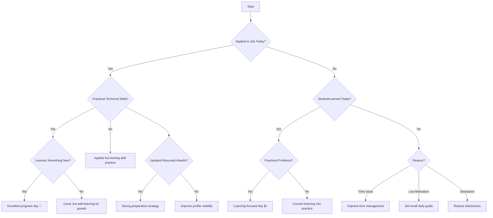

# 📊 Daily Job Preparation Reflection System




## 🤖 AI Agent

This project includes a rule-based AI agent designed to simulate decision-making for daily job preparation evaluation.

The agent takes inputs such as job applications, learning, and practice, and provides meaningful feedback based on predefined logic.

The system ensures transparency and reliability by avoiding probabilistic outputs and relying on deterministic logic.

---

## 🛡️ Guardrails Implemented

- Input validation ensures only valid responses are accepted  
- Rule-based logic prevents AI hallucination  
- Outputs are predefined and controlled  
- No random or misleading responses  
- Handles missing or invalid inputs safely  

---

## ⚙️ How to Run

```bash
python agent.py
```

---

## 🧪 Example Output

Input:
Applied = No  
Studied = Yes  
Practiced = No  

Output:
Convert learning into practice 
